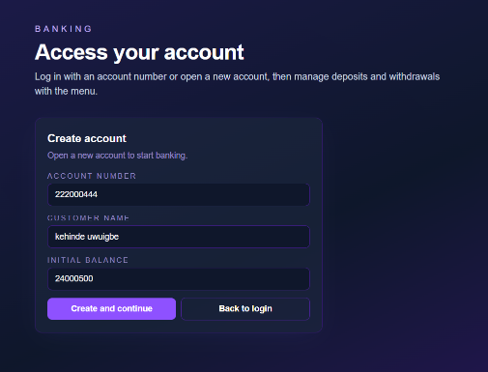
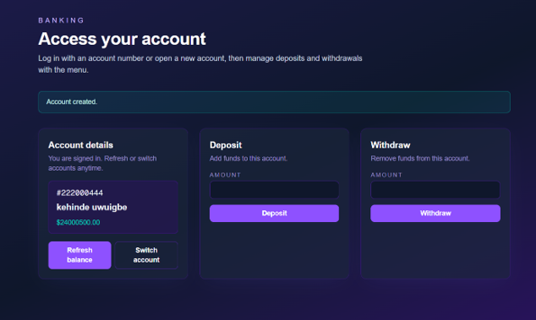

# Banking App (Spring Boot)

RESTful API plus optional console runner for basic banking operations using Spring Boot, JDBC, and MySQL.

**Live demo:** https://mjabank.vercel.app/

## Table of Contents
- [Prerequisites](#prerequisites)
- [Database setup](#database-setup)
- [Configure connection](#configure-connection)
- [How to run locally](#how-to-run-locally)
- [Screenshots](#screenshots)
- [API quick curl checks](#api-quick-curl-checks)
- [Optional CLI](#optional-cli)
- [Tests](#tests)
- [Project Journey Step by Step](#project-journey-step-by-step)

## Prerequisites
- Java 17+
- Maven 3.8+
- MySQL server

## Database setup
1) Create DB and user (example):
```sql
CREATE DATABASE banking_db;
CREATE USER 'bank_user'@'localhost' IDENTIFIED BY 'user123';
GRANT ALL ON banking_db.* TO 'bank_user'@'localhost';
FLUSH PRIVILEGES;
```
2) Create the `accounts` table:
```sql
USE banking_db;
CREATE TABLE accounts (
  account_number INT PRIMARY KEY,
  customer_name VARCHAR(255) NOT NULL,
  balance DECIMAL(15,2) NOT NULL DEFAULT 0
);
```

## Configure connection
Export env vars before running:
```bash
export DB_URL="jdbc:mysql://localhost:3306/banking_db"
export DB_USERNAME="bank_user"
export DB_PASSWORD="user123"
```
`.env` files are not auto-loaded; `set -a; source .env; set +a` will export them if you prefer.

## How to run locally
- Backend: set DB env vars, ensure MySQL + `accounts` table, then `mvn spring-boot:run`.
- Frontend (Next.js): `cd banking-frontend && npm run dev` (uses port 3000, calls backend at 8080).

## Screenshots

- Login Page : 


- Dashboard: 



## API quick curl checks
- Create: `curl -X POST http://localhost:8080/api/accounts -H "Content-Type: application/json" -d '{"accountNumber":1,"customerName":"Alice","balance":100}'`
- Deposit: `curl -X POST http://localhost:8080/api/accounts/1/deposit -H "Content-Type: application/json" -d '{"amount":50}'`
- Withdraw: `curl -X POST http://localhost:8080/api/accounts/1/withdraw -H "Content-Type: application/json" -d '{"amount":20}'`
- View: `curl http://localhost:8080/api/accounts/1`


## Optional CLI
Run the interactive console (non-web):
```bash
mvn -DskipTests exec:java -Dexec.mainClass=Banking.BankingApp
```

## Tests
Run unit tests (in-memory stub, no DB required):
```bash
mvn test
```


# Project Journey (Step-by-Step)

Chronological steps we followed to build and wire the app end to end.

## 1) Initial console app
- Plain Java classes: `Account`, `AccountDAO`, `BnkAccountDaoImpl`, `TransactionController`, `BankingApp`, etc.
- Manual JDBC with hardcoded URL/user/pass and a CLI loop.

## 2) Maven setup
- Added `pom.xml` (Java 17) and `.gitignore`.
- Added MySQL driver dependency.
- Created Maven layout under `src/main/java`.

## 3) Database config
- Created `.env` for DB settings and noted exporting env vars (`DB_URL`, `DB_USERNAME`, `DB_PASSWORD`).
- Defined schema: `accounts` table with `account_number`, `customer_name`, `balance`.

## 4) Testing foundation
- Added JUnit 5 deps and a controller/service test with in-memory stub DAO.

## 5) Upgrade to Spring Boot API
- Switched POM to Spring Boot parent with web + JDBC starters.
- Added Boot entrypoint `BankingApplication`.
- Added `application.properties` using env-driven datasource config.
- Refactored DAO to use `JdbcTemplate` with `AccountNotFoundException`.
- Introduced `TransactionService` for business logic/validation.
- Added `TransactionRestController` exposing JSON endpoints:
  - `POST /api/accounts`
  - `POST /api/accounts/{id}/deposit`
  - `POST /api/accounts/{id}/withdraw`
  - `PUT /api/accounts/{id}/balance`
  - `GET /api/accounts/{id}`
- Optional CLI updated to run via Spring context without web.

## 6) Frontend (Next.js)
- Scaffolded `banking-frontend` with `.env.local` pointing to backend (`NEXT_PUBLIC_API_BASE_URL=http://localhost:8080/api`).
- Implemented main page with:
  - Login by account number or create account
  - Show active account details
  - Deposit, withdraw, refresh balance, logout
  - Success/error messaging


## File + class overview
- `pom.xml`: Maven config using Spring Boot with web/JDBC/test dependencies.
- `JOURNEY.md`, `README.md`, `banking_db.sql`: project history, setup notes, and the MySQL schema seed.
- Java config/entrypoints: `src/main/java/Banking/BankingApplication.java` (Boot launcher), `src/main/java/Banking/BankingApp.java` (optional CLI runner).
- Java domain/contracts: `src/main/java/Banking/Account.java` (account model), `src/main/java/Banking/TransactionDTO.java` (amount/account payload), `src/main/java/Banking/AccountDAO.java` (DAO contract).
- Java infrastructure: `src/main/java/Banking/BnkAccountDaoImpl.java` (JdbcTemplate DAO), `src/main/java/Banking/DatabaseConnection.java` (legacy raw JDBC helper, not used by Spring), `src/main/resources/application.properties` (datasource config).
- Java services/API: `src/main/java/Banking/TransactionService.java` (business rules), `src/main/java/Banking/TransactionRestController.java` (REST endpoints), `src/main/java/Banking/AccountNotFoundException.java` (404 mapping), `src/main/java/Banking/TransactionView.java` (legacy console printer).
- Tests: `src/test/java/Banking/TransactionControllerTest.java` (service tests with in-memory DAO stub).
- Frontend core: `banking-frontend/app/page.tsx` (UI flow for login/create/deposit/withdraw), `banking-frontend/app/layout.tsx` (root shell), `banking-frontend/app/globals.css` (styling), `banking-frontend/lib/api.ts` (client for backend).
- Frontend config/assets: `banking-frontend/next.config.ts`, `banking-frontend/tsconfig.json`, `banking-frontend/postcss.config.mjs`, `banking-frontend/eslint.config.mjs`, `banking-frontend/package.json`, `banking-frontend/package-lock.json`, `banking-frontend/public/*.svg`, `banking-frontend/README.md`.
